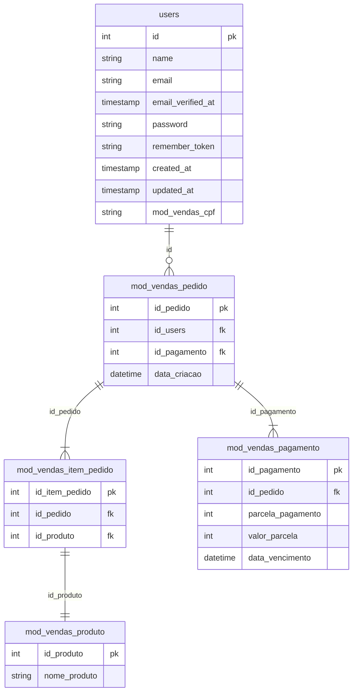

# OBJETIVO

Criar um sistema simples onde é possível criar registros de vendas de produtos.

# VIEWS

- Vendas
    - Clientes(Cadastro de Clientes)
    - Itens(Cadastro de produtos)
    - Compra
    - Pagamento
- Pedidos Realizados
- Login(Opcional)

## VENDAS

### Clientes

#### **Campos:**
a
- [x] Cadastro
    - [x] Nome Completo
    - [x] CPF

### Produto

#### Campos:

- [x] Cadastrar Produto
    - [x] Nome do produto
    - [x] Valor do produto

### Vendas

#### **Campos:**

SEÇÃO DE VENDA:

- [x] Puxar uma lista de clientes existentes
- [x] Puxar uma lista de produtos
- [ ] Campo de quantidade(vir pré-preenchido)
- [ ] Campo de valor unitário(vir pré-preenchido)
- [ ] Subtotal
- [ ] Adicionar
    - [ ] Após adicionado, permitir editar e excluir produtos  
        SEÇÃO PAGAMENTOS:
    - [ ] Quantidade de Parcelas
        - [ ] Valor da parcela  
            Obs. Deixar disponível a possibilidade de valores diferentes em parcelas: 2x $500 e 10x $100 totalizando 12 parcelas.

## Pedidos Realizados

- Lista de pedidos realizados.
    - ID
    - Nome do Cliente
    - Data do pedido
    - Botão de editar
    - Botão de excluir
- Filtro de pesquisa(OPCIONAL)
- Baixar em PDF(OPCIONAL)

## Login(OPCIONAL)

Login de vendedor.(Usuário e Senha)

# BANCO DE DADOS RELACIONAL

